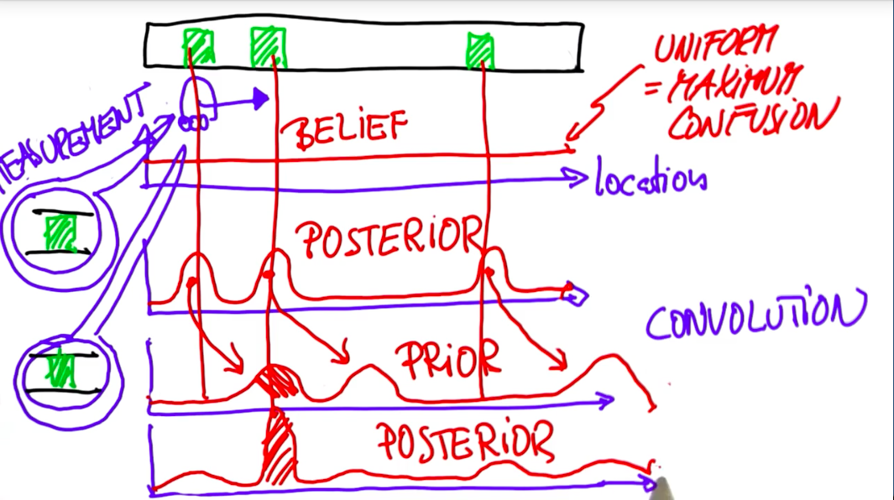
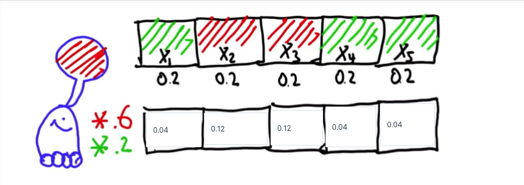
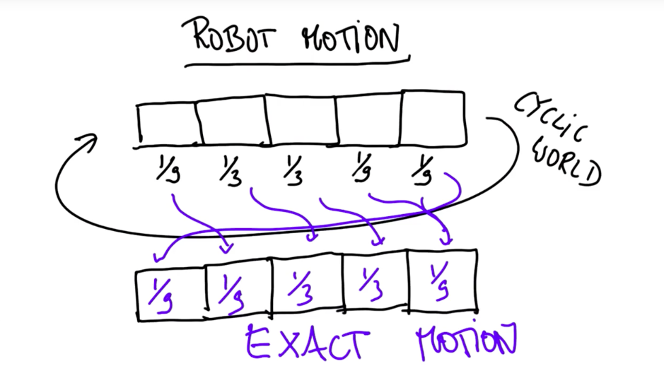
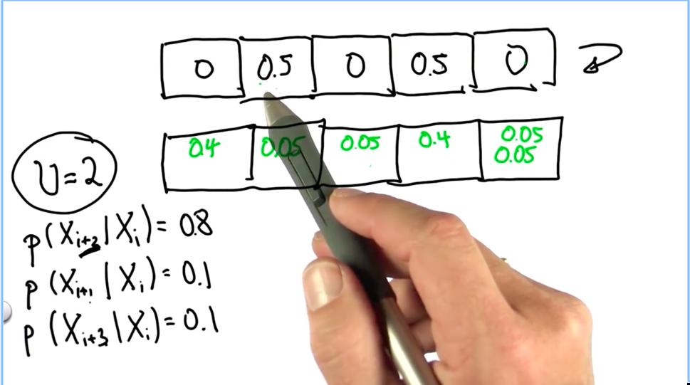
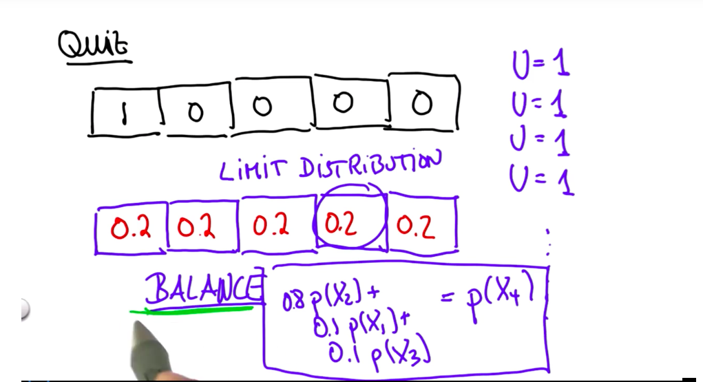

**the first graph is when the robot first time sees the door, all the door position's probability increases;
now, time shift (at this moment), the robot has no detection, the shape is only shifted (pure based on math), and the shape unchanged, the second graph;
now the robot detects the door again, all the door positions' probability increases again, but this time, the product is performed, which leads to a peak in the second door position, thus this procedure gives the robot's position at the second door.**

---

**in below picture, the red box is given 0.6, the green one is given 0.2. when the robot sees red, all the red boxes are multiplied by 0.6, all the green boxes are multiplied by 0.2; what if the robot sees the green, the probability remains unchanged?**

---

**for the exact motion, what's the exact motion? why the probability moves one cell?  this correspond to the second graph on overview graph, it simply shift the probability**

---

**why the two 0.05 are added? why the sum of probability should be one? the way the teacher count cells is good, by counting in parallel.**

---

**the derivation**

---

**the sense-move cycle understanding with given data**
```
p=[0.2, 0.2, 0.2, 0.2, 0.2]
world=['green', 'red', 'red', 'green', 'green']
measurements = ['red', 'green']
motions = [1,1]
pHit = 0.6
pMiss = 0.2
pExact = 0.8
pOvershoot = 0.1
pUndershoot = 0.1
**************************************************
0.6989700043360187
Sensing-----------
[0.1111111111111111, 0.3333333333333332, 0.3333333333333332, 0.1111111111111111, 0.1111111111111111]
after sense: 0.6361616729595498
Moving-----------
[0.11111111111111112, 0.13333333333333333, 0.311111111111111, 0.311111111111111, 0.1333333333333333]
after move: 0.6548958465470218
Sensing-----------
[0.1578947368421053, 0.06315789473684212, 0.1473684210526316, 0.44210526315789467, 0.1894736842105263]
after sense: 0.6184873508024925
Moving-----------
[0.21157894736842103, 0.1515789473684211, 0.08105263157894739, 0.16842105263157897, 0.3873684210526316]
after move: 0.6451998297748291
[0.21157894736842103, 0.1515789473684211, 0.08105263157894739, 0.16842105263157897, 0.3873684210526316]
```

the first measurement is `red`, which makes the second and third cells have higher probability, meaning that the robot may in position of 2 or 3; 
then move one step right, the probability becomes more "uniform", meaning that the uncertainty increases. this transfer is purely determined by the uncertainty of robots movement, it's pure loss of information;
then second movement is `green`, which gives the 4th cell highest probability, meaning that, at this stage, the robot is more confident than before that the position is cell 4; intuitively, it's correct, because, the "red" "green" pattern in the world.

now let's try move one more step right, and sensed "green", can the robot get an even higher probability in cell 5?
the answer is yes, the value is now `0.4584717607973422`;
```
0.6989700043360187
Sensing-----------
[0.1111111111111111, 0.3333333333333332, 0.3333333333333332, 0.1111111111111111, 0.1111111111111111]
after sense: 0.6361616729595498
Moving-----------
[0.11111111111111112, 0.13333333333333333, 0.311111111111111, 0.311111111111111, 0.1333333333333333]
after move: 0.6548958465470218
Sensing-----------
[0.1578947368421053, 0.06315789473684212, 0.1473684210526316, 0.44210526315789467, 0.1894736842105263]
after sense: 0.6184873508024925
Moving-----------
[0.21157894736842103, 0.1515789473684211, 0.08105263157894739, 0.16842105263157897, 0.3873684210526316]
after move: 0.6451998297748291
Sensing-----------
[0.25041528239202654, 0.059800664451827266, 0.03197674418604652, 0.1993355481727575, 0.4584717607973422]
after sense: 0.5664451142772899
Moving-----------
[0.4117524916943522, 0.2521594684385382, 0.07607973421926911, 0.0514950166112957, 0.20851328903654492]
after move: 0.6029678272898018
```

let's try again, move right one more step, but this time, it senses "red" (incorrectly) instead of "green", let's see the result:
aha, very interesting, the result shows that the robot get lost, 
`0.1443965517241379, 0.31034482758620696, 0.165948275862069, 0.1149425287356322, 0.26436781609195403`
it becomes more uniform, meaning more uncertain. 
and the entropy is now `0.6692448760666064` which is even higher than the moving step `0.6451998297748291`.

~~let's the solute the MATH!~~
let's the sAlute the MATH!

```
0.6989700043360187
Sensing-----------
[0.1111111111111111, 0.3333333333333332, 0.3333333333333332, 0.1111111111111111, 0.1111111111111111]
after sense: 0.6361616729595498
Moving-----------
[0.11111111111111112, 0.13333333333333333, 0.311111111111111, 0.311111111111111, 0.1333333333333333]
after move: 0.6548958465470218
Sensing-----------
[0.1578947368421053, 0.06315789473684212, 0.1473684210526316, 0.44210526315789467, 0.1894736842105263]
after sense: 0.6184873508024925
Moving-----------
[0.21157894736842103, 0.1515789473684211, 0.08105263157894739, 0.16842105263157897, 0.3873684210526316]
after move: 0.6451998297748291
Sensing-----------
[0.1443965517241379, 0.31034482758620696, 0.165948275862069, 0.1149425287356322, 0.26436781609195403]
after sense: 0.6692448760666064
Moving-----------
[0.23742816091954028, 0.17298850574712643, 0.27931034482758627, 0.17528735632183914, 0.13498563218390808]
after move: 0.6847537626891254
```


