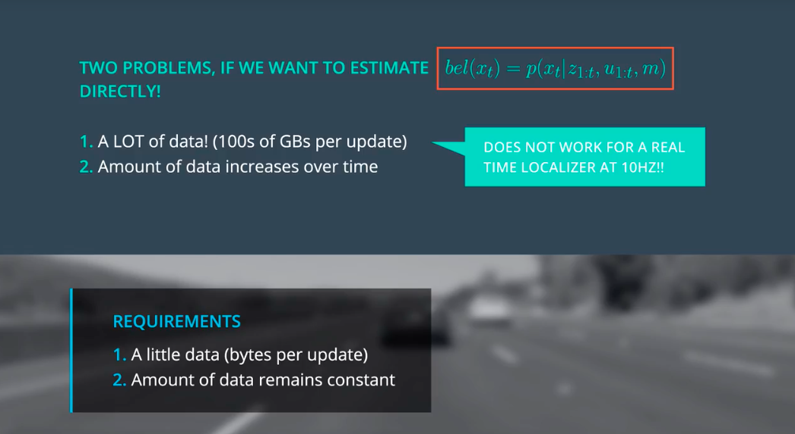

**below images shows that to perform an update, the localization requires all the data from time 1 to time 4. it's a conditional probability, the posterior are the probability of all previous time sequence. considering the huge amount of data, that's why the Markov procedure is necessary.**

in the python code, the update is performed based on all the previous steps, including the observation data as well as the motion data.

