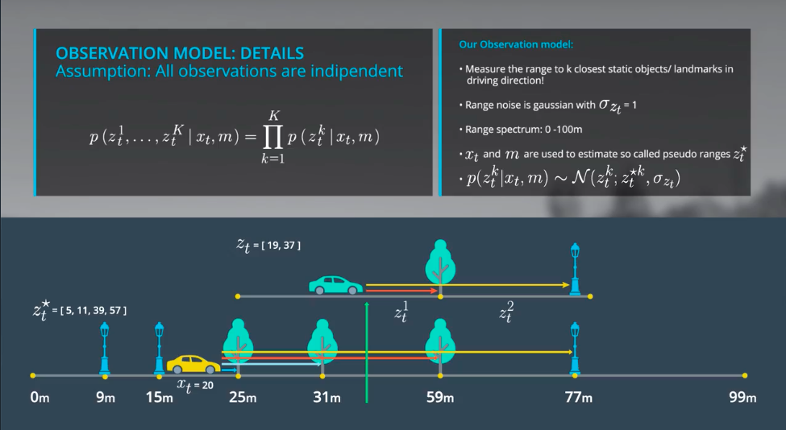

**below images shows that to perform an update, the localization requires all the data from time 1 to time 4. it's a conditional probability, the posterior are the probability of all previous time sequence. considering the huge amount of data, that's why the Markov procedure is necessary.**

in the python code, the update is performed based on all the previous steps, including the observation data as well as the motion data.

----

**what's this picture all about? why the lecturer said it was "unlikely", why? what's unlikely?**

in this stage, there are two values, one is the real observed value, the other is the the "predicted" value based on x_t and map, the "unlikely" means the predicted value compared to the real value;
how this is represented in the localization overview's scenario? 

