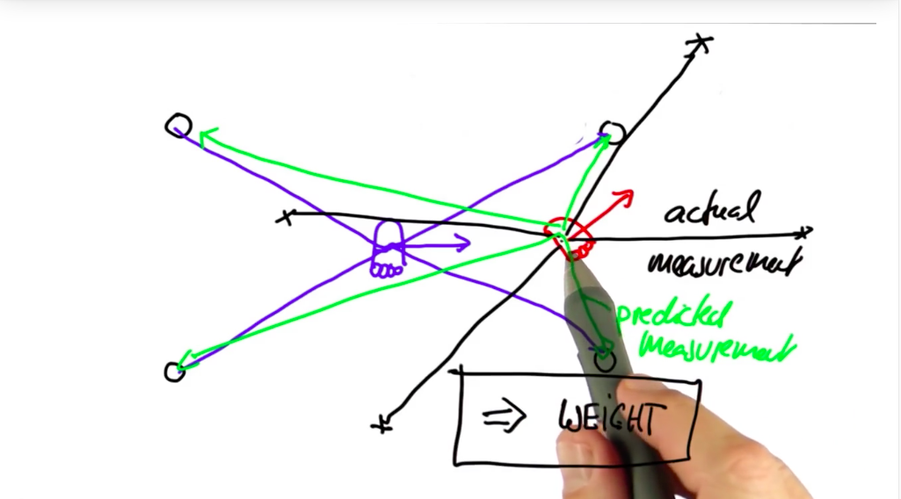
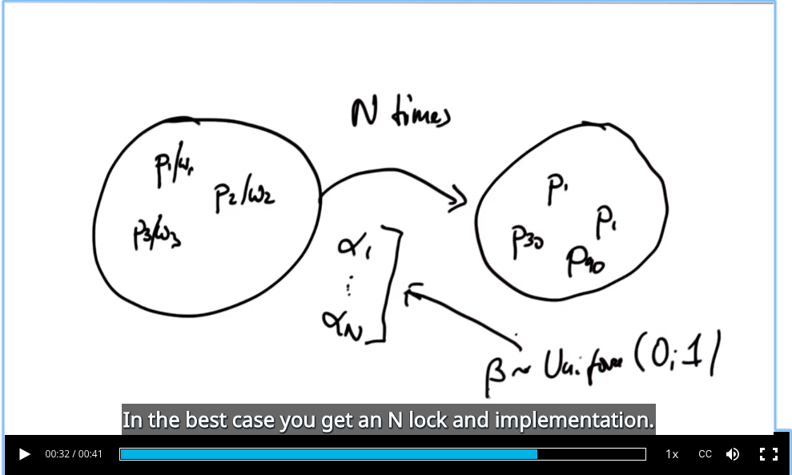
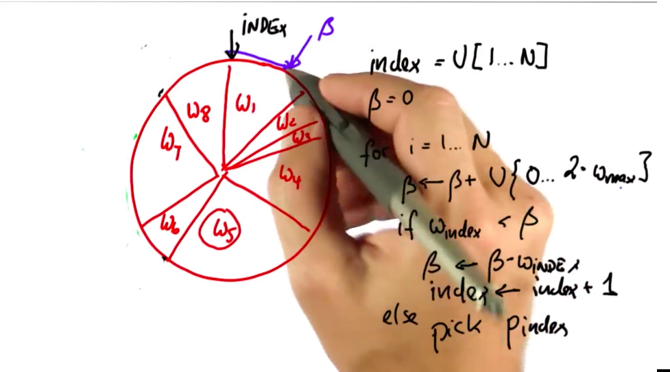
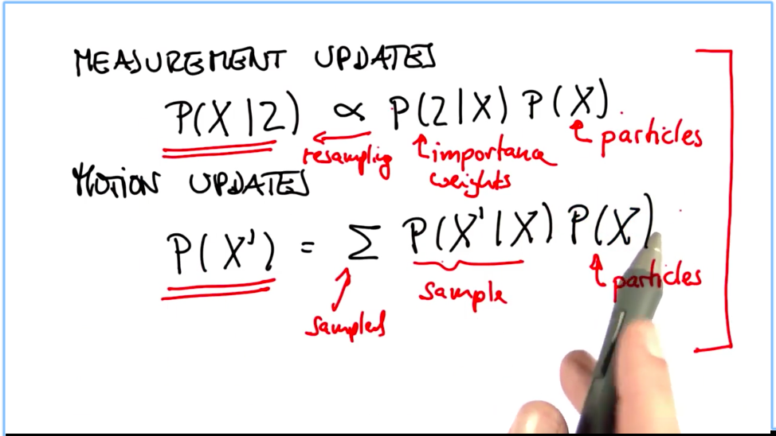

**what's the meaning of the black line in below picture? what's the measurement vector? how to calculate the measurement?**

---

**not quite understand what's the slide, whats' the uniform beta, why sum up alpha?**

---

**understading this trick**

---

**the mathematic framwork for all the filters**

---